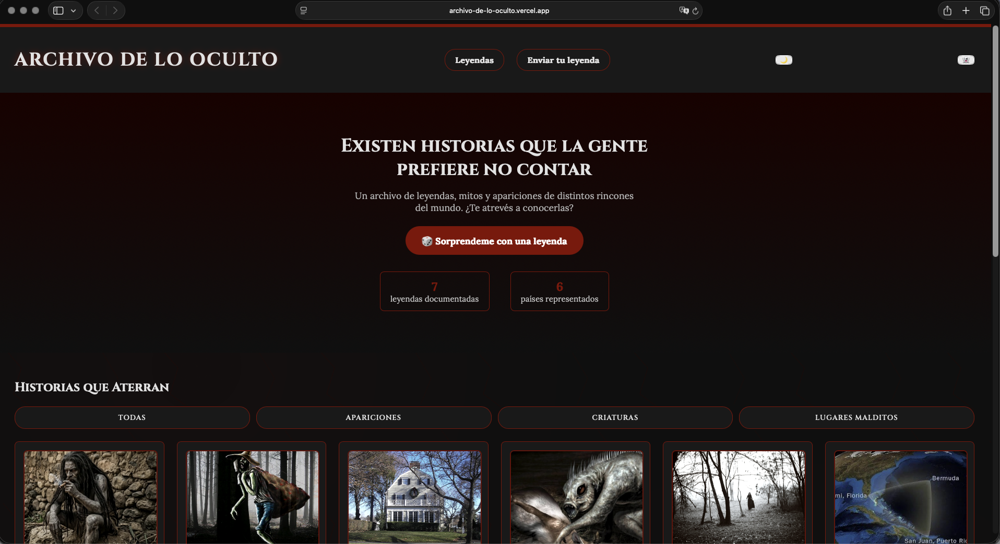
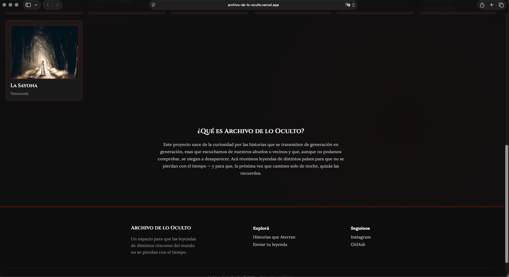
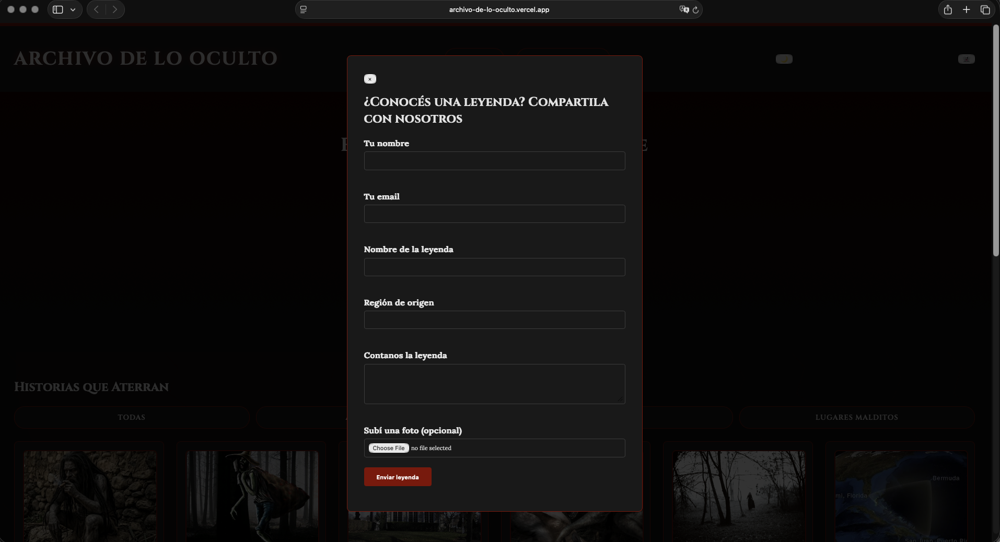
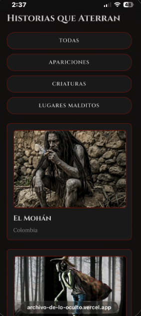

# Archivo de lo Oculto

## Descripción del proyecto

Archivo de lo Oculto es un sitio web que reúne leyendas, mitos y apariciones de distintos países, con el objetivo de que estas historias no se pierdan con el tiempo. Está pensado para cualquier persona curiosa por el folclore y las historias de terror tradicionales de Latinoamérica y otras regiones del mundo.

El sitio funciona como un catálogo interactivo: se puede filtrar por categoría (apariciones, criaturas, lugares malditos), ver el detalle completo de cada leyenda en un modal, descubrir una leyenda al azar, y enviar una leyenda propia a través de un formulario con validación.

**Sitio en vivo:** https://archivo-de-lo-oculto.vercel.app

## Capturas

### Escritorio

### Móvil

## Decisiones técnicas

### ¿Dónde usaste Flexbox y dónde Grid, y por qué en cada caso?

Primero use FlexBox en todos lo lugares que necesitaba acomodar elementos en una sola columna o fila, un ejemplo claro es en el header, para poner el titulo a la izquierda y el menu de navegacion a la derecha, los botones de filtro de categorias para que quedaran repartidas en el espacio entero de la pantalla de mismo tamaño, y tambien en el espacio del formulario con el footer incluido.

Use Grid solamente en el catalogo de leyendas, porque ahi si se necesitaba una cuadricula real de dos dimensiones que son filas y columnas, y queria que la cantidad de columnas se ajustara al ancho de la pantalla sin tener que agregar reglas para cada tamaño. Con grid-template-columns: repeat(auto-fit, minmax(250px, 1fr)), logre que por ejemplo en el celular se viera solo en una sola columna y en pantallas como el computador aparezcan varias columnas de tarjetas una al lado de la otra, todo automatico.

En pocas palabras: utilice FlexBox si es una fila o columna simple, y Grid si es una cuadricula de tarjetas que se deben de organizar.

### ¿Qué hace tu JavaScript, explicado sin copiar el código? ¿Cómo funciona tu validación?

Mi JavaScript se encarga principalmente en generar el contenido de la pagina de forma dinamica, en vez de escribirlo a mano en HTML. Por ejemplo tengo un array con todas las leyendas (cada una con su nombre, region, categoria, historia y nivel de veracidad) y con un ciclo recorro todo este array de leyendas para crear automaticamente cada tarjeta del catalogo que vemos en la pagina.

Tambien arme un sistema de filtros: cada boton de categoria tiene guardado a que categoria le pertenece y al hacer click compara esa tal categoria con la tarjeta para mostrarla o no.

Para mostrar el detalle de cada leyenda, hice una funcion que recibe una leyenda y llena un modal con toda su informacion, incluyendo la barra que muestra su nivel de veracidad. Esta misma funcion la reutilizo para cuando el usuario presiona el boton de "sorprendeme" que elige una leyenda aleatoria al azar con Math.random().

El formulario de contacto (Enviar leyenda) tiene su propia validacion: antes de dejar que se envie, se revisa que el nombre tenga al menos 3 caracteres, que el email tenga un formato valido, que los campos obligatorios no esten vacios y que la descripcion tenga al menos 20 caracteres. Si algo falla o falta, muestra el mensaje de error justo debajo del campo en rojo, no con una alerta emergente. Uso una variable que funciona como "bandera" que empieza en verdadero y se pone en falso apenas encuentra un error; si se mantiene en verdadero hasta el final, muestra el mensaje de exito.

### Si usaste IA, ¿para qué la usaste y qué cambiaste tú del resultado?

Si, utilice e implemente la IA durante todo el proceso de desarrollo del proyecto, principalmente como estilo tutor. La use para que me explicara conceptos o ayudara a reforzarlos de esta materia, como FlexBox, Grid, arrays de objetos, funciones reutilizables, localStorage y expresiones para validar el email. En vez de pedirle que me hiciera todo el sitio, le iba preguntando por que funcionaba cada cosa y fue un proceso de aprendizaje mas que todo.

Lo que hice por mi cuenta: escribir parte del codigo y si habia error me ayudaba, escribir el contenido real de las leyendas (investigando cada una), conseguir y organizar mis propias fotos, decidir el diseño y dar indicaciones concretas sobre que queria cambiar como lo son colores, secciones nuevas o lo mas interesante el modo escalofrio, y sobre todo, depurar los errores que fui teniendo. Por ejemplo, cuando se me borraron las leyendas del catalogo, tuve que revisar el navegador y comparar los bloques de codigo para encontrar el problema del codigo duplicado, y lo mismo paso con la llave de cierre de CSS que hacia que el efecto no funcionara.

Tambien fui yo el que manejo todo el proceso de Git: crear las ramas, hacer los commits en cada etapa, resolver los problemas que me fueron apareciendo con las carpetas. La IA me explicaba los conceptos y me daba el codigo de ejemplo, pero entender porque fallaba y corregirlo fue mi parte.

### ¿Qué fue lo más difícil y cómo lo resolviste?

Cuando estaba reorganizando el código para crear la función ab1rirModalLeyenda, cometí el error de no eliminar el código viejo que quedaba duplicado, y ese bloque no quedó bien cerrado con sus llaves correspondientes. Esto provocó un error en todo el archivo script.js: fue una falla grande, ya que desaparecieron las leyendas del catálogo y nada de lo que llevaba hecho funcionaba. Tuve que revisar los bloques de código uno por uno para identificar y eliminar el bloque duplicado.

Otro problema similar ocurrió al crear el efecto de temblor para la página: no pasaba nada al presionar el botón. Al final, encontré que faltaba un solo carácter (una llave de cierre '}') en el CSS. Se me había pasado escribirla, y por eso el efecto no se aplicaba. Este caso me enseñó que en programación un solo carácter puede romper una función entera, así que ahora reviso con más cuidado que cada bloque de código esté bien cerrado.

## Tecnologías usadas

- HTML5 semántico
- CSS3 (variables, Flexbox, Grid, animaciones, media queries)
- JavaScript (sin frameworks)
- Google Fonts (Cinzel y Lora)
- Git y GitHub para control de versiones
- Vercel para el despliegue